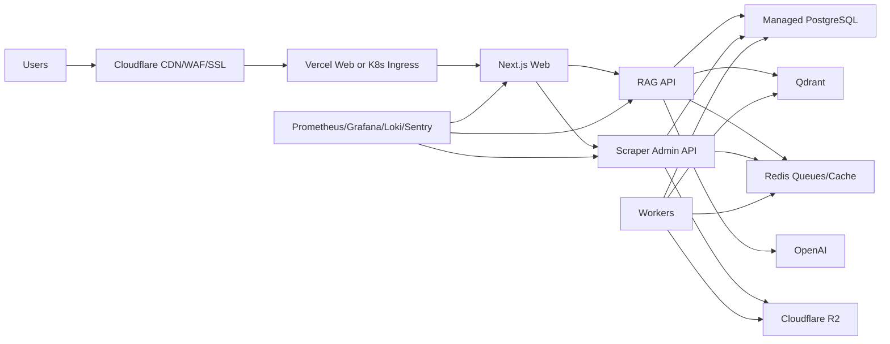
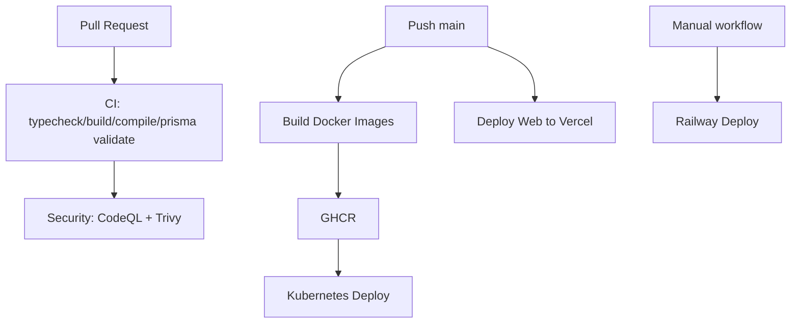

# Gospel Library IA DevOps Architecture

## Deployment Targets

### Local

```bash
docker compose up --build
docker compose --profile observability up
docker compose --profile edge up
docker compose --profile backup up
```

### Vercel + Railway

```txt
Vercel:
  apps/web

Railway:
  rag-api
  scraper-api
  scraper workers
  Redis optional for staging

Managed:
  PostgreSQL with PITR
  Qdrant Cloud
  Cloudflare R2
  Cloudflare WAF/CDN
```

### Kubernetes

```txt
Ingress + cert-manager
web Deployment
rag-api Deployment + HPA
rag-worker-indexing Deployment + HPA
scraper-api Deployment
scraper worker Deployments
Redis StatefulSet or managed Redis
Qdrant StatefulSet or Qdrant Cloud
PostgreSQL managed outside cluster
CronJob backups
Prometheus/Grafana/Loki/Sentry
```

## Infrastructure Diagram



## CI/CD Diagram



## Deployment Strategy

### Web

Preferred:

- Vercel for Next.js.
- Cloudflare in front for WAF/CDN.
- `/api/rag/*` proxied to API gateway.

Alternative:

- Containerized web on Kubernetes.

### APIs

Preferred enterprise:

- Kubernetes or container platform with private networking.
- Deploy `rag-api` and `scraper-api` separately.
- Use separate worker deployments per queue.

### Databases

- PostgreSQL managed service with PITR.
- Redis managed service for queues and cache.
- Qdrant Cloud or Qdrant StatefulSet.
- Cloudflare R2 for objects.

## Scaling Strategy

### Web

- Vercel autoscaling or Kubernetes HPA.
- CDN cache static assets.
- Keep SSR/API proxy lightweight.

### RAG API

Scale on:

- CPU
- p95 latency
- concurrent streams
- request rate

Start:

```txt
min: 2 replicas
max: 20 replicas
```

### RAG Workers

Scale on:

- Redis queue depth
- embedding backlog
- CPU
- OpenAI rate limits

Use separate queue:

```txt
rag-indexing
```

### Scraper Workers

Separate by cost profile:

```txt
scraping: network + Playwright
assets: network + R2
ocr: CPU/memory heavy
indexing: coordination
```

OCR should run on larger nodes.

### PostgreSQL

- Managed primary with PITR.
- Read replica for search/listing if needed.
- Keep vector storage in Qdrant.
- Partition append-heavy tables.
- Use PgBouncer if connection pressure grows.

### Qdrant

- Start single node for staging.
- Move to Qdrant Cloud or cluster for production.
- Use collection versioning:
  - `doctrinal_chunks_v1`
  - `doctrinal_chunks_v2`

## Secrets Strategy

Never commit real secrets.

Use:

- GitHub Actions secrets
- Vercel env vars
- Railway variables
- Kubernetes Secrets or External Secrets Operator
- Cloudflare API tokens scoped per zone/bucket

Critical secrets:

```txt
DATABASE_URL
REDIS_URL
OPENAI_API_KEY
QDRANT_API_KEY
R2_ACCESS_KEY_ID
R2_SECRET_ACCESS_KEY
SENTRY_DSN
KUBE_CONFIG
VERCEL_TOKEN
RAILWAY_TOKEN
```

## Backup Strategy

### PostgreSQL

- PITR enabled.
- Daily logical `pg_dump` to R2.
- Monthly restore test.
- Retention:
  - daily: 7
  - weekly: 4
  - monthly: 6-12

### Qdrant

- Scheduled snapshots.
- Store snapshots in R2.
- Keep embedding metadata in PostgreSQL so vectors can be rebuilt.

### R2

- Object versioning.
- Lifecycle policies for temp exports.
- Separate prefixes:
  - `assets/`
  - `exports/`
  - `backups/`
  - `qdrant-snapshots/`

## Observability

### Metrics

- API latency p50/p95/p99
- chat stream duration
- retrieval latency
- OpenAI token usage
- embedding backlog
- queue depth
- worker failures
- scraper block rate
- OCR duration
- Qdrant query latency
- PostgreSQL slow queries

### Logs

- JSON structured logs.
- Include:
  - request_id
  - user_id if available
  - organization_id if available
  - job_id
  - document_id
  - source_key

### Tracing

Use OpenTelemetry when production traffic starts:

```txt
web -> rag-api -> PostgreSQL/Qdrant/OpenAI
scraper -> workers -> R2/PostgreSQL
```

### Error Tracking

Sentry projects:

- web
- rag
- scraper

## Security

### Edge

- Cloudflare WAF
- Bot protection
- rate limiting
- SSL full strict
- HSTS after validation

### App

- security headers
- CORS allowlist
- JWT/session hardening
- prompt injection mitigation
- RAG citation grounding
- admin access protected by RBAC and Cloudflare Access

### Containers

- scan with Trivy
- avoid root when possible
- minimal base images
- no secrets in image layers
- pinned dependency versions

## Rate Limiting

Recommended:

```txt
/api/rag/chat*: 30 req/min/IP
/api/rag/search: 120 req/min/IP
/api/scraper/admin*: admin only
/api/uploads: strict size and auth limits
```

## Production Release Flow

1. Pull request.
2. CI passes.
3. Security workflow passes.
4. Merge to `main`.
5. Images built and pushed to GHCR.
6. Web deploys to Vercel.
7. APIs deploy to Kubernetes or Railway.
8. Migrations run.
9. Smoke tests.
10. Monitor dashboards and Sentry.
