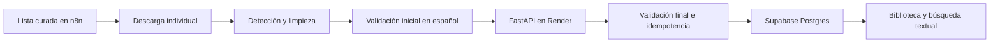

# Arquitectura de ingesta curada con n8n

## Responsabilidades

### n8n: orquestador

n8n mantiene la lista explícita de URLs, descarga un recurso por vez, detecta
su tipo, limpia HTML, aplica una primera validación de español y prepara el
payload. No decide la persistencia final ni accede directamente a Supabase.

### Render API: validador y guardador

FastAPI recibe `POST /api/ingestion/documents`, verifica `X-Ingestion-Key`,
aplica nuevamente las reglas de fuente, idioma, longitud y texto limpio,
normaliza URLs, calcula el hash y controla la idempotencia.

La API es la autoridad final. Un workflow modificado o defectuoso no puede
omitir sus validaciones.

### Supabase Postgres: contenido estructurado

Postgres conserva:

- fuentes;
- autores;
- documentos;
- texto limpio;
- metadata verificable;
- tags;
- chunks de aproximadamente 800 a 1200 caracteres;
- URL original, URL canónica y hash de contenido.

No se guarda HTML crudo.

### Supabase Storage: no usado

Storage no se usa en esta etapa. Las páginas web permanecen referenciadas por
su URL original. Los PDF se omiten hasta disponer de extracción controlada; si
se habilita, se enviará texto limpio y se conservará la URL sin almacenar el
binario.

### Qdrant: pendiente

No se crean vectores ni colecciones. El estado de Qdrant no bloquea ingesta,
Biblioteca, detalle ni búsqueda textual.

### OpenAI: pendiente

No se generan resúmenes, embeddings, traducciones ni contenido doctrinal. El
texto guardado debe proceder de la fuente indicada y llegar ya en español.

## Flujo

## Límites de confianza

- La URL y el texto externo son datos no confiables.
- La API key solo autentica al orquestador; no vuelve confiable al payload.
- `source_name` enviado por n8n es auditivo. La API deriva el nombre canónico
  desde su allowlist.
- `canonical_url`, idioma, HTML y longitud se validan en FastAPI.
- Los secretos se mantienen en Render y en variables o credenciales de n8n.

## Idempotencia

La API verifica:

1. URL canónica normalizada.
2. URL fuente normalizada.
3. SHA-256 del texto limpio.
4. Restricciones únicas de documentos y chunks.

Una repetición válida devuelve `verified_existing` sin duplicar contenido.

## Fuentes

- Discursos SUD: fuente curada secundaria, no oficial.
- BYU Speeches Español: fuente académica curada, no oficial de la Iglesia.
- Sitio oficial de la Iglesia: fuente oficial con máxima confianza.

La procedencia debe mostrarse siempre. El sistema no presenta fuentes
secundarias como publicaciones oficiales.
