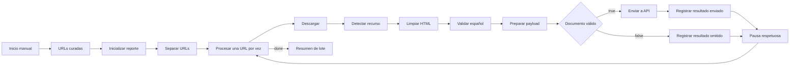

# Arquitectura de ingesta curada con n8n

## Responsabilidades

### n8n

n8n mantiene una lista explícita de URLs, descarga un recurso por vez, extrae
texto limpio, valida calidad mínima, envía documentos válidos a la API y resume
el lote. No hace crawling ni accede directamente a Supabase.

### FastAPI en Render

La API recibe `POST /api/ingestion/documents`, autentica el orquestador, valida
fuente, idioma, URL, longitud, placeholders e idempotencia, y guarda en
PostgreSQL/Supabase. La API es la autoridad final.

### Supabase/PostgreSQL

Postgres conserva fuentes, autores, documentos, texto limpio, metadata, tags y
chunks. No se guarda HTML crudo.

### Qdrant y OpenAI

No participan en esta fase. La ingesta funciona con búsqueda textual y chunks en
Postgres.

## Flujo

## Reglas de entrada

- Solo fuentes permitidas: sitio oficial de la Iglesia, BYU Speeches Español y
  Discursos SUD.
- El sitio oficial debe usar `lang=spa`.
- BYU Speeches debe usar ruta `/spa/`.
- Se rechazan `eng`, `por`, `fra`, `ita`, `deu`, contenido de prueba y
  placeholders.
- El payload final siempre usa `language="es"`.

## Control de lote

**Inicializar reporte de lote** limpia `gospel_library_ingestion_results` al
inicio. **Registrar resultado enviado** agrega resultados producidos por la API.
**Registrar resultado omitido** agrega documentos descartados antes del POST. Al
terminar el batch, **Resumen de lote** lee ese acumulador y devuelve conteos,
títulos creados, URLs rechazadas y todos los resultados.

## Límites de confianza

- La URL y el texto externo son datos no confiables.
- La clave de ingesta autentica al workflow, pero no vuelve confiable el
  payload.
- El backend vuelve a validar todo.
- Los secretos permanecen en Render y n8n, nunca en payloads ni logs.

## Idempotencia

Una repetición válida devuelve `verified_existing`. La API evita duplicados por
URL canónica, URL fuente y hash de contenido.
